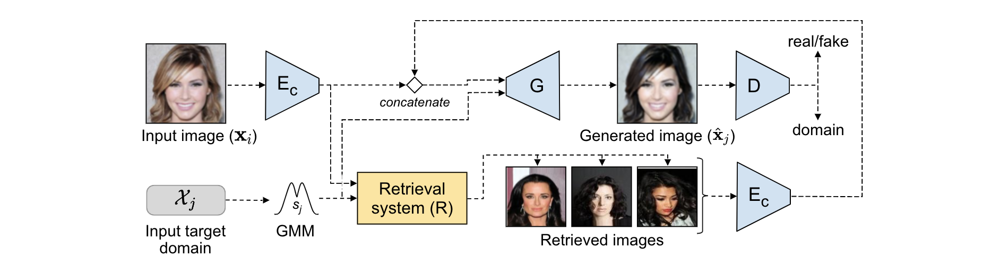

## RG-UNIT

Retrieval Guided Unsupervised Multi-domain Image to Image Translation, to appear in ACM International Conference on Multimedia(**ACM MM**), 2020. [[Paper]](https://dl.acm.org/doi/pdf/10.1145/3394171.3413785)|[[arXiv]](http://arxiv.org/abs/2008.04991)|[[code]](https://github.com/yhlleo/RG-UNIT)




### 1 Configuration

 - See the [`environment.yml`](./environment.yaml). We provide an user-friendly configuring method via Conda system, and you can create a new Conda environment using the command:

```
conda env create -f environment.yaml
```

### 2 CelebA Faces

 - Dataset: Download from [Google Drive](https://drive.google.com/open?id=1HnayuXVgqhT1RPzjSV_-yvCp5SxMXPo6), then copy it into `datasets/celeba`:

```
cd datasets/celeba
unzip img_align_celeba.zip
mv img_align_celeba images
```

 - Folder structure:

```
../datasets
  |__celeba
       |__images
       |    |__xxx.jpg
       |    |__...
       |__list_attr_celeba.txt
```

### 3 Pretrained Models

(1) **GMMUNIT + Retrieval**:

 - Download pretrained models: 
   - [`models/celeba_gmm_gen.pt`](https://drive.google.com/file/d/1wVYCx5JwTs_UsyxsxYbAAcDAybucdk4-/view?usp=sharing)
   - [`models/celeba_gmm_dis.pt`](https://drive.google.com/file/d/1kMUy4H5aaRR7_F7LX2v4Cqjgi7MSSH9O/view?usp=sharing)
   
 - Retrieval models & image embeddings:
   - [`models/ret_gmm_00020000.pt`](https://drive.google.com/file/d/1DQysTWCLgL7b-izdoJdzr8unzTXv0dKA/view?usp=sharing)
     - [`models/images_embeddings_gmm.json`](https://drive.google.com/file/d/11nSjoFfIo4kcwkULJ6HsTFkYgrQlY9BL/view?usp=sharing)

### Training

 - a) Preparing GMM-UNIT: copy the model into `./models/celeba_gmm_gen.pt`

 - b) Training Retrieval-Net: `sh ./scripts/train_retrieval_gmm.sh 0 0`

 - c) Training GMM-UNIT + Retrieval: `sh ./scripts/celeba_gmmunit_retrieval.sh 0 0`


### References

If our project is useful for you, please cite our papers:

```
@inproceedings{raul2020retrieval,
author = {Gomez, Raul and Liu, Yahui and De Nadai, Marco and Karatzas, Dimosthenis and Lepri, Bruno and Sebe, Nicu},
title = {Retrieval Guided Unsupervised Multi-Domain Image to Image Translation},
booktitle = {Proceedings of the 28th ACM International Conference on Multimedia},
year = {2020},
doi = {10.1145/3394171.3413785},
url = {https://doi.org/10.1145/3394171.3413785}
}
