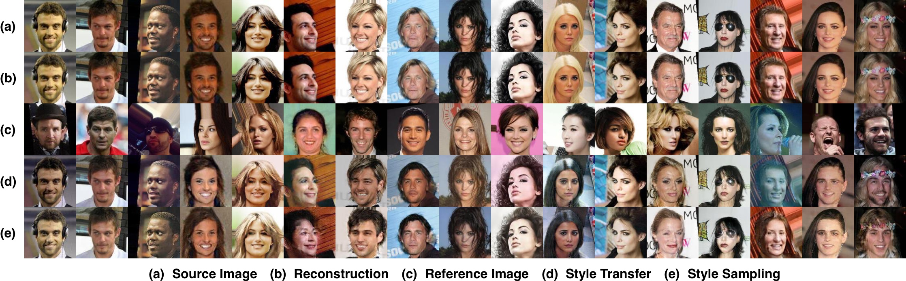
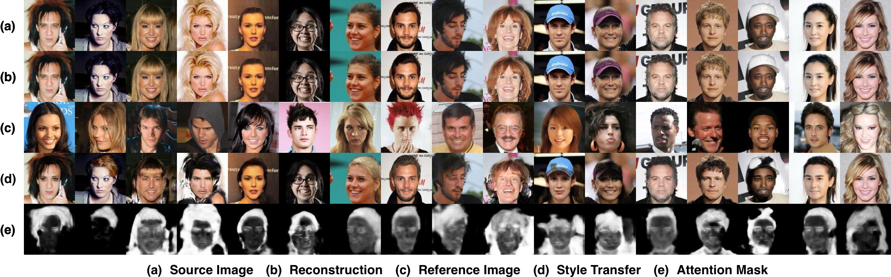

[]((https://github.com/yhlleo/RG-UNIT/graphs/commit-activity))


Retrieval Guided Unsupervised Multi-domain Image to Image Translation, accepted to ACM International Conference on Multimedia(**ACM MM**), 2020. [[Paper]](https://dl.acm.org/doi/pdf/10.1145/3394171.3413785)|[[arXiv]](http://arxiv.org/abs/2008.04991)|[[code]](https://github.com/yhlleo/RG-UNIT)

 > Image to image translation aims to learn a mapping that transforms an image from one visual domain to another. Recent works assume that images descriptors can be disentangled into a domain-invariant content representation and a domain-specific style representation. Thus, translation models seek to preserve the content of source images while changing the style to a target visual domain. However, synthesizing new images is extremely challenging especially in multi-domain translations, as the network has to compose content and style to generate reliable and diverse images in multiple domains. In this paper we propose the use of an image retrieval system to assist the image-to-image translation task. First, we train an image-to-image translation model to map images to multiple domains. Then, we train an image retrieval model using real and generated images to find images similar to a query one in content but in a different domain. Finally, we exploit the image retrieval system to fine-tune the image-to-image translation model and generate higher quality images. Our experiments show the effectiveness of the proposed solution and highlight the contribution of the retrieval network, which can benefit from additional unlabeled data and help image-to-image translation models in the presence of scarce data


## 1. Configuration

 - See the [`environment.yml`](./environment.yaml). We provide an user-friendly configuring method via Conda system, and you can create a new Conda environment using the command:

```
conda env create -f environment.yaml
```

## 2. Datasets

 - CelebA: Download from [Google Drive](https://drive.google.com/open?id=1HnayuXVgqhT1RPzjSV_-yvCp5SxMXPo6), then copy it into `datasets/celeba`:

```
$ cd datasets/celeba
$ unzip img_align_celeba.zip
$ mv img_align_celeba images
```

Then, preparing the dataset in the following structure:

```
./datasets
  |__celeba
       |__images
       |    |__xxx.jpg
       |    |__...
       |__list_attr_celeba-train.txt
       |__list_attr_celeba-val.txt
```

 - AFHQ: Download from the [StarGAN v2](https://github.com/clovaai/stargan-v2) project. 

Then, preparing the dataset in the following structure:

```
./datasets
  |__afhq
       |__train
       |    |__cat
       |    |    |__xxx.jpg
       |    |    |__...
       |    |__dog
       |         |__xxx.jpg
       |         |__...
       |__val
       |    |__cat
       |    |    |__xxx.jpg
       |    |    |__...
       |    |__dog
       |         |__xxx.jpg
       |         |__...
       |
       |__train_list.txt
       |__test_list.txt
```

## 3. Train

 - Train GMM-UNIT model

```
$ sh train_gmmunit.sh
```

 - Train retrieval network

```
$ sh train_retrieval.sh
```

 - Update the GMM-UNIT model aided by retrieval network

```
$ sh train_gmmunit_retrieval.sh
```


## 4. Pretrained models 

Here, we release the pretrained models in Google Drive:


 - GMM-UNIT without self-attention:



|Name|Description|Download Link|
|:----|:----|:----:|
|`gmmunit_gen.pth`|Pretrained generator of GMM-UNIT model|:ok_hand:[link](https://drive.google.com/file/d/1e9xED3FqsWdZA1a90MNWt2U0fAr29O8o/view?usp=sharing)|
|`gmmunit_dis.pth`|Pretrained discriminator of GMM-UNIT model|:ok_hand:[link](https://drive.google.com/file/d/1v410br_zBZI_YGrzEy5tig2c6ySqbI-7/view?usp=sharing)|
|`gmmunit_ret.pth`|Pretrained retrieval network|[link]()|
|`image_embeddings.pth`|Image embeddings extracted by the pretrained model on the training images of CelebA|[link]()|
|`rgunit_gen.pth`|generator of RG-UNIT model|[link]()|
|`rgunit_dis.pth`|discriminator of RG-UNIT model|[link]()|

For fast verification, we can using the following demo:

```
$ 
```

 - GMM-UNIT with self-attention:



|Name|Description|Download Link|
|:----|:----|:----:|
|`gmmunit_gen.pth`|Pretrained generator of GMM-UNIT model|:ok_hand:[link](https://drive.google.com/file/d/13P9M2a7zLdL2c_oUFTe6kaa8bhVAoec4/view?usp=sharing)|
|`gmmunit_dis.pth`|Pretrained discriminator of GMM-UNIT model|:ok_hand:[link](https://drive.google.com/file/d/17hliWFTmQDDvm623WUx8u0W7-Rl-sePK/view?usp=sharing)|
|`gmmunit_ret.pth`|Pretrained retrieval network|[link]()|
|`image_embeddings.pth`|Image embeddings extracted by the pretrained model on the training images of CelebA|[link]()|
|`rgunit_gen.pth`|generator of RG-UNIT model|[link]()|
|`rgunit_dis.pth`|discriminator of RG-UNIT model|[link]()|

For fast verification, we can using the following demo:

```
$ 
```

## 5. Evaluation codes

We evaluate the performances of the compared models mainly based on this repo: [GAN-Metrics](https://github.com/yhlleo/GAN-Metrics)


### References

If our project is useful for you, please cite our papers:

```
@inproceedings{raul2020retrieval,
author = {Gomez, Raul and Liu, Yahui and De Nadai, Marco and Karatzas, Dimosthenis and Lepri, Bruno and Sebe, Nicu},
title = {Retrieval Guided Unsupervised Multi-Domain Image to Image Translation},
booktitle = {Proceedings of the 28th ACM International Conference on Multimedia},
year = {2020},
doi = {10.1145/3394171.3413785},
url = {https://doi.org/10.1145/3394171.3413785}
}

@article{liu2020gmm,
  title={GMM-UNIT: Unsupervised Multi-Domain and Multi-Modal Image-to-Image Translation via Attribute Gaussian Mixture Modeling},
  author={Liu, Yahui and De Nadai, Marco and Yao, Jian and Sebe, Nicu and Lepri, Bruno and Alameda-Pineda, Xavier},
  journal={arXiv preprint arXiv:2003.06788},
  year={2020}
}
```

The baseline model GMM-UNIT is based on this paper: [GMM-UNIT: Unsupervised Multi-Domain and Multi-Modal Image-to-Image Translation via Attribute Gaussian Mixture Modeling](https://arxiv.org/pdf/2003.06788.pdf).
